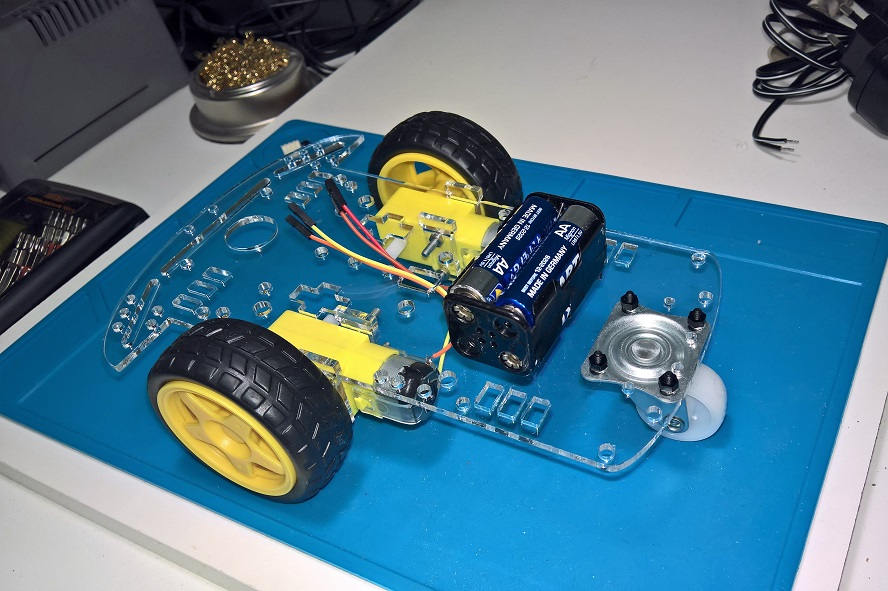
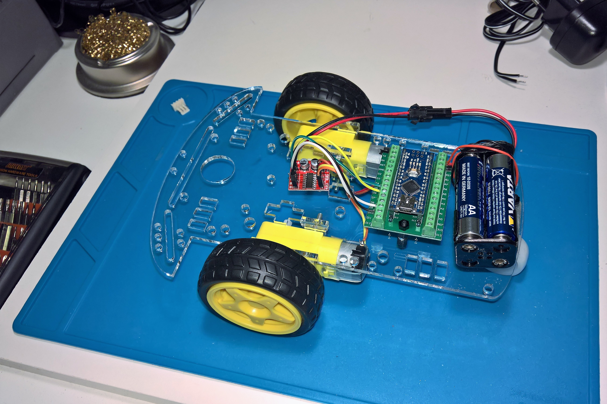
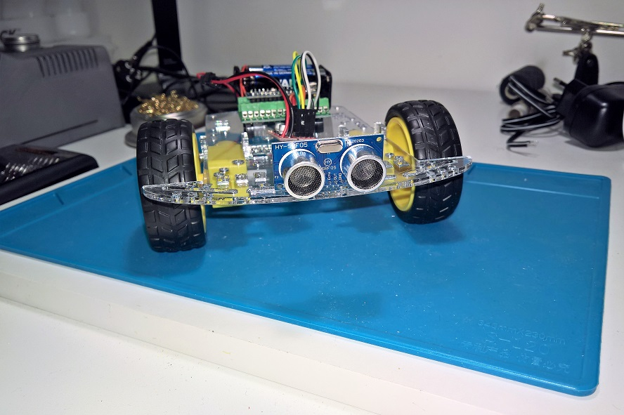

# RoverBot-2WD-MK1

Dette er et pågående prosjekt som undersøker mulighetene for å lage et mini-kurs rund det å bygge et selvgående kjøretøy. Kurset er tenkt arrangert av KodeKlubben Moss i samarbeid med Verket FabLab.

Det er viktig at prosjektet gir barn glede av å bygge, og at man får en forståelse av hvorfor programmering er nyttig.

__Prosjektet har følgende mål:__
*	Tilgjengelig for alle
    *	Lav pris
    *	Både nybegynnere og de med noe erfaring finner noe å strekke seg etter
*	Benytte verktøy/ tjenester fra FabLab

## Noen tenkte "trinn" i kurset
Nedenfor følger tre tenkte trinn i kurset, men her er det muligheter for å legge inn flere. F.eks. dekorering. Det er også mulig å lage forskjellige grener. F.eks. kan man lage en gren hvor man tar utgangspunkt i micro:bit.

### Nivå 1 - Av/På
Dette er grunnleggende og minimum av hva man bør gjennomføre iløpet av kurset

### Nivå 2 - Kontrollert kjøring
Her introduseres mikrokontroller og programmering. Målsetning er å gjøre dette i "Scratch"/ visuelt verktøy.

mBlock utvidelse for MotorDriverL298N er oversatt til Norsk.

### Nivå 3 - Unngår hinder
Kjøretøyet utvides med sensor, og programmeres for å håndtere hinder

## Foreløpig materialkostnad

Komponenter                       | Pris (NOK) | Beskrivelse
:---------------------------------|------------:|:------------------------
__Nivå 1__
Chassis (Akryl  300 x 200 x 3)    |   ??        |
Gir-Motor m. hjul                 |  40,-       |
Batteriholder - 4xAA              |   7,-       |
Bryter                            |   2,-       |
Skruer                            |   5,-       |
Leddhjul                          |  20,-       | 
__Nivå 2__                        
Arduino Nano                      |  20,-       |
Montering blokk                   |  15,-       |
H-Bridge Motor driver             |   6,-       | 1.5A Mini Dual Channel DC Motor Driver Module L298N PWM 
__Nivå 3__
Avstandsensor                     |  10,-       | + Festebrakett
