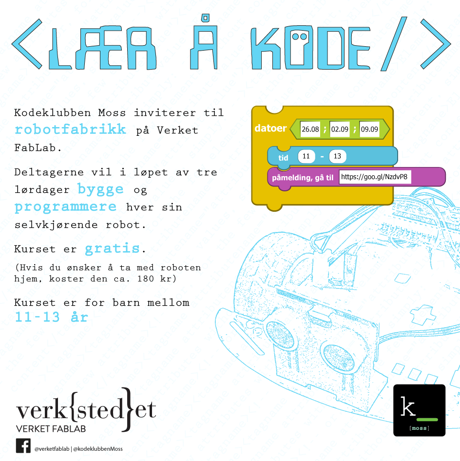

# Velkommen til prosjektsiden for RoverBot-2WD-MK1

## Hvem:

Kurset er lagte for og av KodeKlubben Moss i samarbeid med Verket FabLab.  Et av målene var å tilby alle barn muligheten til å bygge og programmere hver sin robot .

## Hva:
Ved å kombinere byggerglede, gratis programvare og rimelige komponenter har barna laget en trehjuling som er i stand til å navigere i et rom uten å kollidere med gjenstander. Ved kursslutt fikk de muligheten til å kjøpe roboten for under 200,-

## Hvor:
Prosjektet ble gjennomført ved Verket FabLab over 3 lørdager med 2 timers økter.

## [Klikk her](/docs/Oppsummering.pdf) for å se en oppsummering av hva vi har gjort.

----------------

