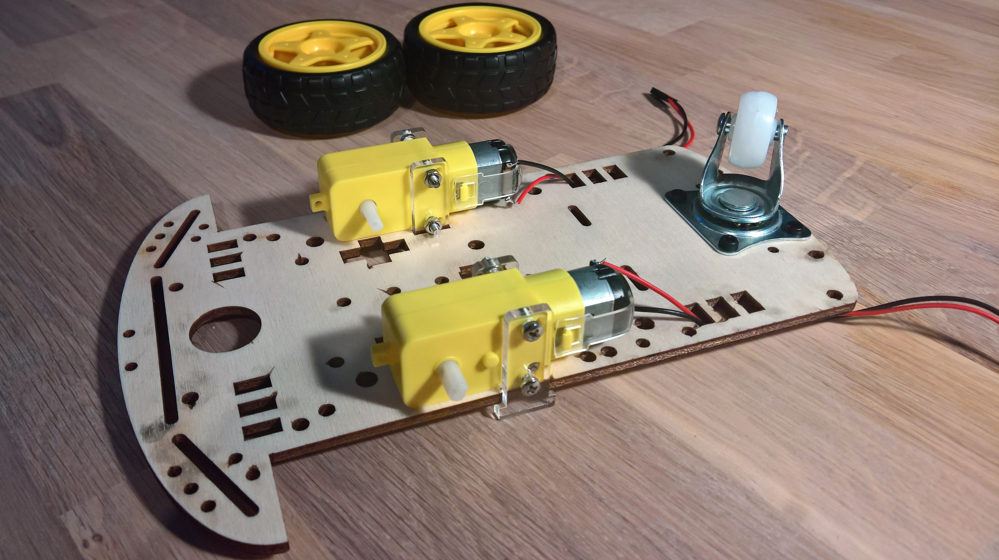
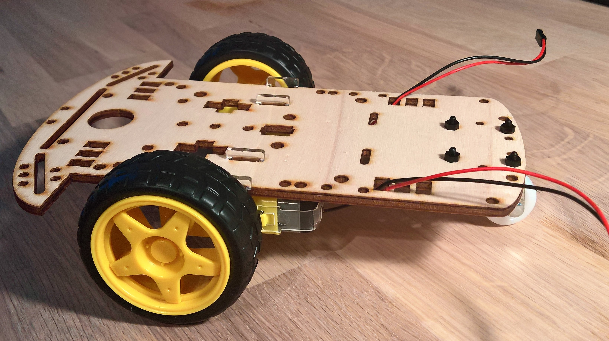
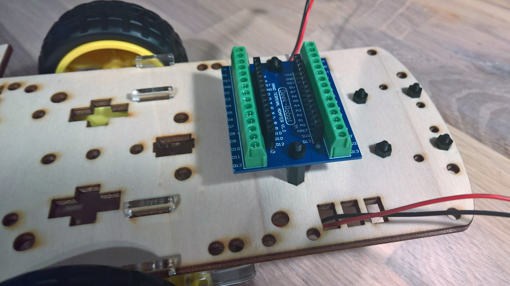

# Montere Base

## Steg 1: Feste motorer og halehjul

__Vent med å sette hjulene på motor drevet. Da blir det enklere å feste motorene.__

## Steg 2: Montere hjul

## Steg 3: Feste koblingsblokk for Arduino Nano

## [Klikk her](/design/WiringSketch/README.md) for å gå til neste steg hvor vi kobler elektronikken.
